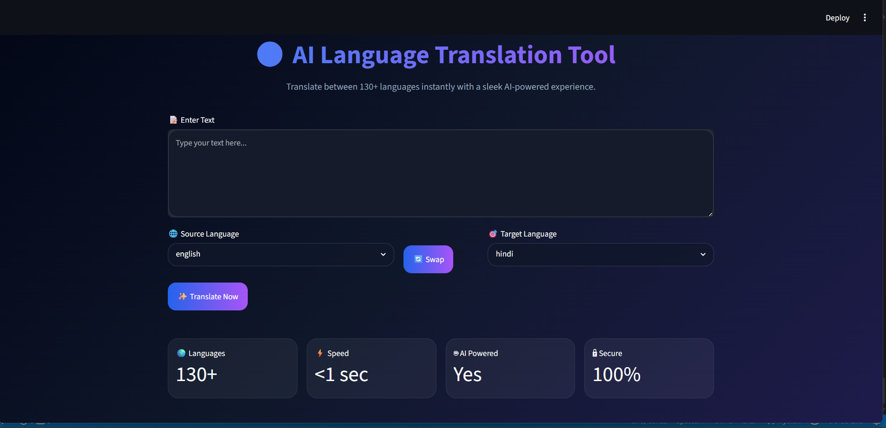
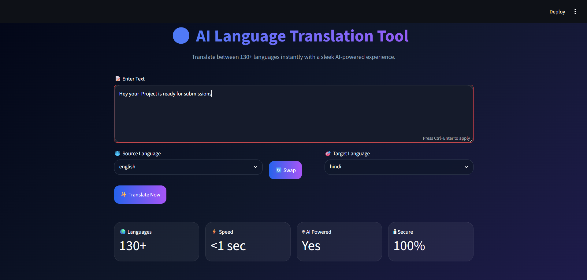
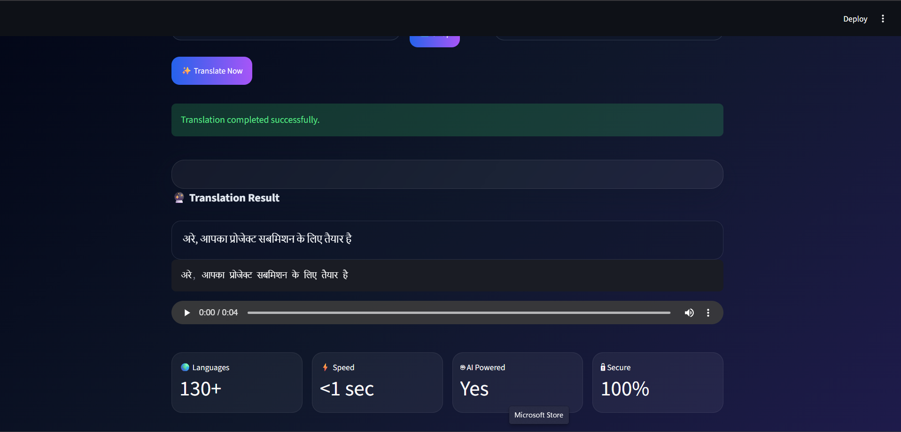

# 🌍 AI Language Translation Tool

An AI-powered Language Translation Tool developed using **Python**, **Streamlit**, and **Google Translate API**. This application allows users to translate text between 130+ languages in real time through an intuitive and modern user interface.

## 🚀 Features

* 🌐 Translate text between 130+ languages
* 📝 User-friendly text input interface
* 🔄 Source and target language selection
* ⚡ Real-time translation using Google Translate API
* 🔊 Text-to-Speech functionality for translated text
* 🎨 Modern and responsive Streamlit UI
* 🛡️ Error handling for unsupported inputs and API issues
* 📋 Copy translated text easily
* 🌏 Support for major global languages including English, Hindi, Marathi, Chinese, Japanese, French, German, Spanish, and more

---

## 🛠️ Technologies Used

* Python
* Streamlit
* Deep Translator (Google Translate API)
* gTTS (Google Text-to-Speech)
* HTML/CSS (for custom UI styling)

---

## 📂 Project Structure

```text
CodeAlpha_Language_Translator/
│
├── app.py
├── requirements.txt
├── README.md
└── screenshots/
```

---

## ⚙️ Installation

### 1. Clone the Repository

```bash
git clone https://github.com/sohamdhake27/CodeAlpha_Language_Translator.git
cd CodeAlpha_Language_Translator
```

### 2. Install Dependencies

```bash
pip install -r requirements.txt
```

### 3. Run the Application

```bash
streamlit run app.py
```

---

## 📸 Screenshots

### Home Page

<p align="center">
  
</p>

### Translation Result

<p align="center">
  
</p>

### Translated
<p align="center">
  
</p>

---

## 💡 How It Works

1. Enter text in the input area.
2. Select the source language.
3. Select the target language.
4. Click the **Translate** button.
5. View the translated output instantly.
6. Listen to the translated text using the Text-to-Speech feature.

---

## 🎯 Internship Task Objective

This project was developed as part of the **Artificial Intelligence Internship Program at CodeAlpha**.

Task Requirements Implemented:

* User Interface for text input
* Source and Target Language Selection
* Translation API Integration
* Real-Time Translation Output
* Text-to-Speech Enhancement

---

## 🔮 Future Enhancements

* Voice Input (Speech-to-Text)
* Translation History
* Language Detection
* Export Translation as PDF
* AI-Powered Context-Aware Translation

---

## 👨‍💻 Author

**Soham Dhake**

Artificial Intelligence & Data Science Student

Passionate about Artificial Intelligence, Machine Learning, NLP, and Software Development.

---

## 📜 License

This project is developed for educational and internship purposes.
